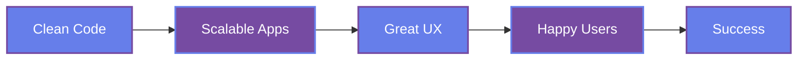

<div align="center">

<!-- ⚠️ غير 'YOUR_GITHUB_USERNAME' باليوزرنيم بتاعك على GitHub في كل الملف -->

<!-- Animated Header -->


<!-- Typing SVG -->
<a href="https://git.io/typing-svg"></a>

<!-- Visitor Badge with Aviation Theme -->
<p align="center">
  
  
  
</p>

---

## 🛩️ **About Me - The Aviation Developer**

```dart
class MohamedMofeedHawas {
  final String role = "Flutter Developer";
  final String education = "Zagazig National University";
  final String major = "Aviation Information Systems";
  final String currentFocus = "Building Next-Gen Aviation Apps";
  final String motto = "Code like you're flying - smooth, precise, and innovative!";
  
  List<String> aviationKnowledge = [
    "✈️ Air Law - Understanding the legal framework of the skies",
    "🗺️ Navigation - Plotting the perfect course",
    "📡 Radio Navigation - Guiding aircraft with precision",
    "🛬 Aerodromes - Mastering airport operations & infrastructure",
    "🛫 ATFM (Air Traffic Flow Management) - Optimizing airspace efficiency",
  ];
  
  Map<String, dynamic> getMyInfo() => {
    "education": education,
    "major": major,
    "passion": "Combining Aviation & Technology",
    "vision": "Transforming aviation through innovative software solutions"
  };
}
```

---

## ✈️ **Aviation Knowledge Base**

<details>
<summary><b>🎓 My Aviation Expertise (Click to Expand)</b></summary>

### 📚 **Courses Completed:**

| Subject | Description | Real-World Application |
|---------|-------------|----------------------|
| **✈️ Air Law** | International and national aviation regulations, ICAO standards, and safety protocols | Understanding legal frameworks for aviation software compliance |
| **🛫 ATFM** | Air Traffic Flow Management - Strategic planning and tactical operations | Optimizing flight scheduling and airspace utilization algorithms |
| **🗺️ Navigation** | Fundamental navigation principles, chart reading, route planning | Building navigation features in aviation applications |
| **📡 Radio Navigation** | VOR, NDB, ILS, GPS navigation systems and procedures | Integrating real-time positioning in flight tracking apps |
| **🛬 Aerodromes** | Airport design, operations, lighting systems, and ground services | Developing airport management and operations software |

### 💡 **Why Aviation + Software = Perfect Combination?**

> *"Aviation is not just about flying; it's about precision, safety, and innovation. 
> Just like clean code - every line matters, every decision counts."*

The aviation industry is rapidly digitalizing. From flight management systems to passenger apps, the future belongs to developers who understand both technology AND aviation. My unique background in Aviation Information Systems gives me the edge to build solutions that truly understand the industry's needs.

</details>

---

## 🚀 **Technical Arsenal**

<p align="center">
  
</p>

### 💻 **Core Skills:**

```yaml
Mobile_Development:
  - Framework: Flutter 💙
  - Language: Dart 🎯
  - State_Management: Cubit/Bloc 🔄
  - API_Testing: Postman 📮
  
Design_&_UI/UX:
  - Tool: Figma 🎨
  - Principle: Clean & Intuitive Interfaces
  
Best_Practices:
  - Clean_Code_Architecture: ✅
  - SOLID_Principles: ✅
  - Design_Patterns: ✅
  - Version_Control: Git & GitHub ✅

Soft_Skills:
  - Communication: Excellent 🗣️
  - Problem_Solving: Advanced 🧩
  - Team_Collaboration: Strong 🤝
  - Time_Management: Efficient ⏰
```

---

## 📊 **GitHub Flight Statistics**

<!-- ⚠️ غير 'YOUR_GITHUB_USERNAME' باليوزرنيم الحقيقي بتاعك -->

<p align="center">
  
  
</p>

<p align="center">
  
</p>

<!-- Activity Graph -->
<p align="center">
  
</p>

---

## 🏆 **GitHub Trophies**

<p align="center">
  
</p>

---

## 💼 **What I'm Building**

<table>
<tr>
<td width="50%">

### 🎯 **Current Focus:**
- 📱 Developing Flutter applications
- 🧹 Mastering Clean Architecture
- 🎨 Creating beautiful, intuitive UIs
- ✈️ Building aviation-related solutions
- 📚 Continuous learning & growth

</td>
<td width="50%">

### 🔭 **Future Goals:**
- 🚀 Launch production Flutter apps
- 🌍 Contribute to open-source
- 📖 Share knowledge through blogs
- ✈️ Innovate in aviation tech
- 🏅 Become a Flutter expert

</td>
</tr>
</table>

---

## 📫 **Connect With Me - Let's Build Something Amazing!**

<!-- ⚠️ غير البريد الإلكتروني ولينك LinkedIn بتوعك -->

<p align="center">
  <a href="mailto:YOUR_EMAIL@gmail.com">
    
  </a>
  <a href="https://linkedin.com/in/YOUR_LINKEDIN_USERNAME">
    
  </a>
  <a href="https://github.com/YOUR_GITHUB_USERNAME">
    
  </a>
  <a href="tel:+201060157100">
    
  </a>
</p>

<p align="center">
  <a href="mailto:YOUR_EMAIL@gmail.com">
    
  </a>
  <a href="tel:+201060157100">
    
  </a>
</p>

---

## 🎯 **My Development Philosophy**

<div align="center">



</div>

---

## 🌟 **Fun Facts About Aviation & Development**

<details>
<summary><b>✈️ Did You Know? (Click to Discover)</b></summary>

### Aviation Facts That Inspire My Coding:

1. **✈️ The Wright Brothers' First Flight (1903)** lasted only 12 seconds - but it changed the world forever!
   - *Developer Lesson:* Small steps lead to revolutionary change. Every commit matters!

2. **📡 GPS Technology** was originally developed for military aviation but now powers billions of apps!
   - *Developer Lesson:* Innovation in one field transforms entire industries.

3. **🛫 Air Traffic Control** manages over 100,000 flights daily worldwide with near-perfect safety records
   - *Developer Lesson:* Robust systems handling massive scale = Clean architecture + proper state management!

4. **🎯 Modern Aircraft** have millions of lines of code - an Airbus A380 has about 100 million!
   - *Developer Lesson:* Complex systems require meticulous planning and clean code practices.

5. **🚀 The Aviation Industry** is projected to reach $1 trillion by 2030
   - *Developer Lesson:* Huge opportunities for tech-savvy aviation professionals!

### Why Aviation Teaches Better Coding:

- **Precision Matters:** In aviation, a single degree off course compounds over distance. In code, small bugs become major issues.
- **Safety First:** Aviation's safety culture mirrors the importance of testing and validation in software.
- **Continuous Learning:** Pilots undergo recurrent training; developers must keep learning new technologies.
- **Teamwork:** Just like flight crews, developers must communicate clearly and collaborate effectively.

</details>

---

## 🐍 **Watch My Contribution Snake**

<!-- ⚠️ لو عاوز الـ snake animation تشتغل، لازم تعمل GitHub Action في الريبو بتاعك -->
<!-- الطريقة: https://github.com/Platane/snk -->

<picture>
  <source media="(prefers-color-scheme: dark)" srcset="https://raw.githubusercontent.com/MohamedMofeedHawas/MohamedMofeedHawas/output/github-snake-dark.svg" />
  <source media="(prefers-color-scheme: light)" srcset="https://raw.githubusercontent.com/MohamedMofeedHawas/MohamedMofeedHawas/output/github-snake.svg" />
  
</picture>

---

## 💭 **Quote That Drives Me**

<p align="center">
  
</p>

---

## 📈 **Weekly Development Breakdown**

<!--START_SECTION:waka-->
```text
Flutter          12 hrs 30 mins  ███████████░░░░░░  45.2%
Dart             8 hrs 15 mins   ███████░░░░░░░░░░  29.8%
Figma            3 hrs 45 mins   ███░░░░░░░░░░░░░░  13.5%
Git/GitHub       2 hrs 10 mins   ██░░░░░░░░░░░░░░░   7.8%
Documentation    1 hr 5 mins     █░░░░░░░░░░░░░░░░   3.7%
```
<!--END_SECTION:waka-->

---

## 🎨 **Profile Views Counter**

<p align="center">
  
</p>

---

<div align="center">

### 🚀 **"Building the Future, One Line of Code at a Time"** 

### ✈️ **"Where Aviation Meets Innovation"**


<!-- Animated Footer -->


</div>

---

<p align="center">
  <i>⭐️ From <a href="https://github.com/MohamedMofeedHawas">Mohamed Mofeed Hawas</a> - Let's connect and build something extraordinary! ✈️💻</i>
</p>

<!-- Social Media Stats -->
<p align="center">
  
  
</p>
